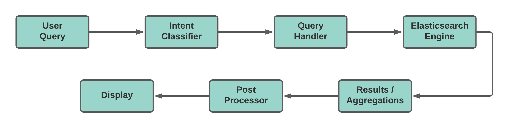

# Sri Lankan Singers Search Engine

This is an information retrieval system built using Elasticsearch and Flask to search Sri Lankan singers.

## Directory Structure

```
├── singer_corpus : scripts (related to data scraping and preprocessing) and corpus
    ├── scraper.py : the script used to scrape data from wikipedia
    ├── singer_information.csv : the original data scraped from wikipedia
    ├── modified_singer_information.csv : after manually adding data from Sri Lankan Singers Association Website and modifying some fields
    ├── sinhala_translator.py : used to translate and trasniliterate fields accordingly
    ├── translated_singer_information.json: final corpus used to create the index
├── metadata : scripts (related to extracting common metadata values from fields) and the metadata itself
    ├── get_metadata.py: script used to extract metadata from fields
    ├── songs.txt : metadata of famous songs sung by the singers 
    ├── instruments.txt : metadata of instruments played by singers
    ├── occupations.txt: metadata of other occupations of singers
├── templates : UI related files
├── static
    ├── styles
        ├── results.css : css file used to style the UI
├── app.py : backend of the web app created using Flask
├── search.py : functions related to classifying user intent and elasticsearch queries
├── queries.txt : list of some sample queries this search engine supports
```

## Project Setup

First run the below commands to clone and install dependencies.

```
git clone https://github.com/NilmaniKulaweera/Search_Sri_Lankan_Singers.git
cd Search_Sri_Lankan_Singers
pip install -r requirements.txt
```
Start elasticsearch cluster on port 9200. Create an index called  `srilankan_singers` and index the data in `singer_corpus/translated_singer_information.json`

Finally to run run the web app,

```
cd Search_Sri_Lankan_Singers
python app.py
```

## Data Fields

Each singer document has the following set of fields.

```
1. singer_name_en: Name of the singer - English
2. singer_name_si: Name of the singer - Sinhala
3. birth_year: Birth year of the singer
4. death_year: Year the singer died (empty if still alive)
5. carrer_start_year: Year the singer started his/her singing career
6. career_end_year: Year the singer ended his/her singing career
7. gender: Gender
8. famous_songs_en: List of famous songs sung by the singer - English
9. famous_songs_si: List of famous songs sung by the singer - Sinhala
10. other_occupations_en: Other occupations of the singer (ex. songwriter) - English
11. other_occupations_si: Other occupations of the singer (ex. songwriter) - Sinhala
12. instruments_played_en: List of musical instruments the singer can play - English
13. instruments_played_si: List of musical instruments the singer can play - Sinhala
14. personal_life_en: Details about the singer’s personal life - English
15. personal_life_si: Details about the singer’s personal life - Sinhala
16. career_en: Details about the singer’s singing career - English
17. career_si: Details about the singer’s singing career - Sinhala
```
## Data Scraping

The ‘BeautifulSoup’ library was used to scrape data from [wikipedia](https://en.wikipedia.org/wiki/List_of_Sri_Lankan_musicians). Then data from [Sri Lankan Singers Association website](http://www.srilankasingers.com/) was manually added to that and some fields were modified as necessary. The aggregated data was then translated and transliterated to Sinhala to create the final corpus which was used to create the index.

## Indexing and Querying

The standard Elasticsearch indexing methods (mapping) were used for indexing the data. When querying the data, the user’s intent is identified and the respective search query is executed. There are a few types of queries which are possible, and they are described in the following section. Also it is possible for the user to filter the retrieved results by gender.



## Advanced Features

- Text mining and text classification
    - The intent behind the query is identified. The user’s intent may be searching explicitly using a specific field. The following intents can be identified by the system.


    ```
    1. Field specific intent - After identifying the intent, the specific field is boosted.
       Eg. හන්තානට පායන සඳ ගීතය ගයන ගායකයා, වයලීනය වාදනය කරන ගායිකාවන්, රැකියාවෙන් පසුබිම් ගායකයෙක් වන පිරිමි ගායකයින්

    2. Range intent
       Eg. 1990 දශකයේ ගායිකාවන්
    ```

- Support for phrase queries
    - Phrase queries are identified and a phrase search is performed. If no results are returned from the phrase query, a normal query search is performed automatically. 

- Faceted search
    - The returned results can be filtered by gender.

- Bilingual support
    - The search engine supports both Sinhala and English queries.

- Synonym support
    - Search engine supports synonyms which can be either in Sinhala or English.
      Eg. සිංදුව, ගීතය, song

- Resistant to simple spelling errors
    - When an intent is identified, a cosine similarity calculation is done to correctly retrieve the data even if there’s a mismatch between the query terms and the document content.